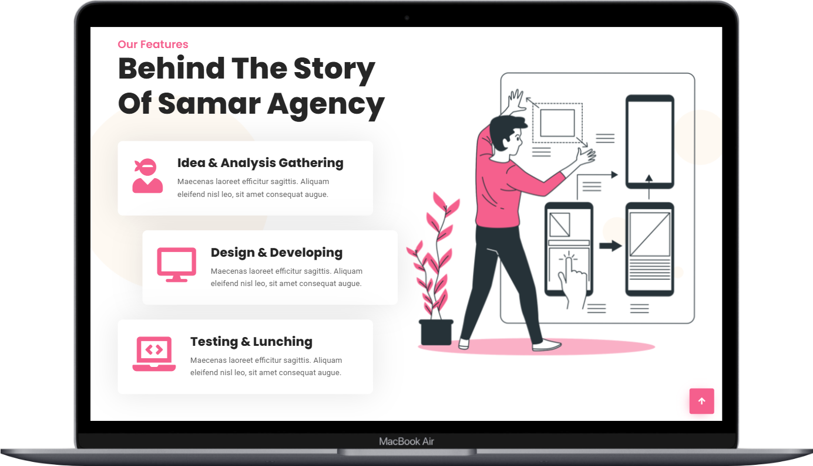
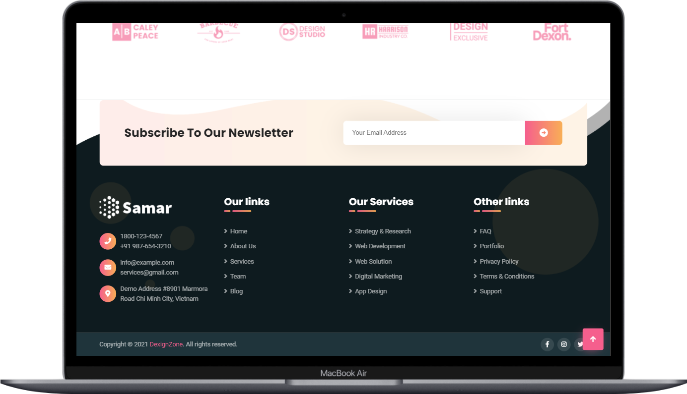

# Samar Homepage Layout

See the live page [Samar](https://scoobytux-samar.vercel.app/ "Samar") 🎀

## Introduction

A webpage layout built with HTML5, CSS3 and Sass.

## Tasks and Roadmap

### Phase 1: Desktop-first design and effects

> Feb 6 - 20, 2022

- [x] Homepage layout with desktop-first design
- [x] Full effects with libraries/ plugins:
  - [animate.css](https://animate.style/ "animate.css") - A cross-browser library of CSS animations
  - [wow.js](https://wowjs.uk/ "wow.js") - Aa JavaScript library that reveals CSS animation as you scroll down a page
  - [lightgallery.js](https://www.lightgalleryjs.com/ "lightGallery.js") - A customizable, modular, responsive, lightbox gallery plugin
  - [Owl Carousel 2](https://owlcarousel2.github.io/OwlCarousel2/ "Owl Carousel 2") - Touch enabled jQuery plugin that lets you create a beautiful, responsive carousel slider
  - [Slick Carousel](http://kenwheeler.github.io/slick/ "Slick Carousel") - A responsive carousel jQuery plugin that supports multiple breakpoints, CSS3 transitions, touch events/swiping & much more!
  - [Font Awesome](https://fontawesome.com/ "Font Awesome") - the Internet's icon library and toolkit

### Phase 2: Responsive design on smaller devices (tablet, mobile, ...)

- [ ] Make responsive design

## Project Structure

```
$PROJECT_ROOT
│   # Resource files
├── assets
│   │   # Image files
│   ├── images
│   │   # JavaScript files
│   ├── scripts
│   │   # Scss files
│   ├── scss
│   │   # CSS files
│   ├── styles
│   │   # Third party libraries/ plugins
│   └── vendors
│   # Screenshots of the project
├── screenshots
│   # Page content
└── index.html
```

### Installation and Run

Check out the webpage -> [Samar](https://scoobytux-samar.vercel.app/ "Samar") or run locally:

- `git clone https://github.com/scoobytux/samar.git`
- `cd samar`
- Open `index.html` file

## Some Project's Views on MacBook/ Laptop

- On MacBook/ Laptop

  

  

  

  

## Credits and Reference

| Resource                                                         | Description          |
| ---------------------------------------------------------------- | -------------------- |
| [https://samar.dexignzone.com/xhtml/index.html][original layout] | The original website |

[original layout]: https://samar.dexignzone.com/xhtml/index.html
